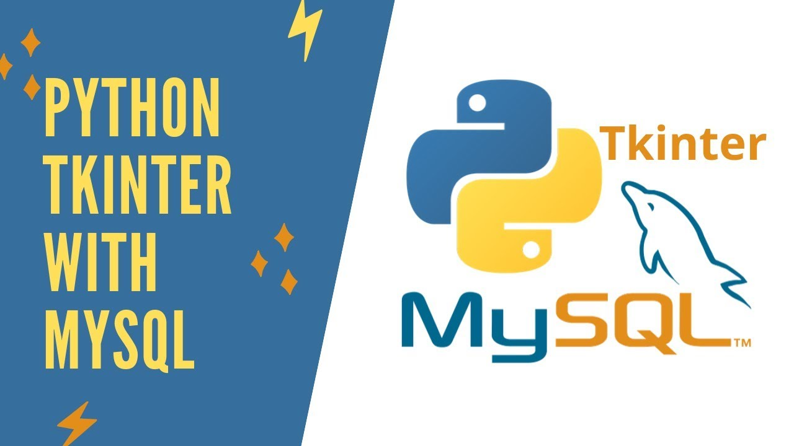

# Python + Tkinter + PyMySQL

Crea Tabla (CREATE), Inserta (INSERT) y Elimina (DELETE)

Este código implementa una interfaz gráfica de usuario (GUI) para el registro, actualización, eliminación y consulta de datos almacenados en una base de datos MySQL. La GUI está desarrollada en TKinter, mientras que la conexión y manipulación de la base de datos se realizan mediante la biblioteca PyMySQL.

El código se divide en funciones específicas para cada tarea: `insertarDatos()` para agregar nuevos registros, `eliminar()` para eliminar registros existentes, `actualizar()` para modificar datos de registros y `consulta()` para obtener información sobre un registro específico. Además, se incluye una función `show()` que muestra todos los registros almacenados en la base de datos.

Para cada función de manipulación de datos, se establece una conexión segura con la base de datos y se ejecuta una consulta SQL con parámetros, lo que garantiza la seguridad y la integridad de los datos. En caso de errores, se manejan excepciones y se muestran mensajes de aviso al usuario.

El código es fácil de entender y seguir, y puede ser utilizado como una base para aplicaciones más complejas que requieren interacción con bases de datos MySQL.

En resumen, este código es una buena referencia para aquellos que desean aprender a interactuar con bases de datos MySQL desde una GUI de Python, y puede ser útil en la implementación de aplicaciones de gestión de datos simples.

# Python + Tkinter + PyMySQL

This code implements a Graphical User Interface (GUI) for registering, updating, deleting, and querying data stored in a MySQL database. The GUI is developed using TKinter, while the connection and manipulation of the database are performed using the PyMySQL library.

The code is divided into specific functions for each task: insertData() for adding new records, delete() for deleting existing records, update() for modifying data in records, and query() for obtaining information about a specific record. Additionally, a show() function is included that displays all the records stored in the database.

For each data manipulation function, a secure connection with the database is established, and an SQL query with parameters is executed, ensuring the security and integrity of the data. In case of errors, exceptions are handled, and warning messages are displayed to the user.

The code is easy to understand and follow, and can be used as a base for more complex applications that require interaction with MySQL databases.

In summary, this code is a good reference for those who want to learn how to interact with MySQL databases from a Python GUI, and can be useful in implementing simple data management applications.
